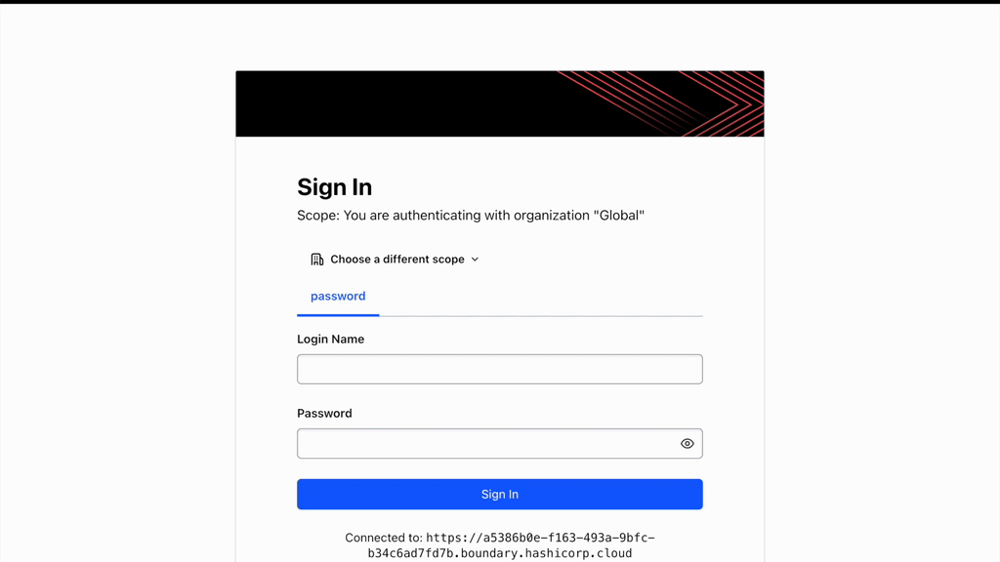
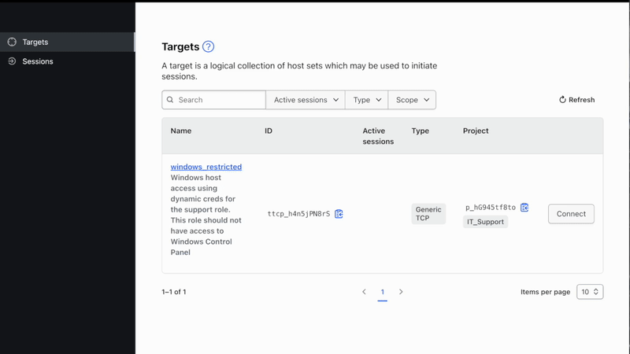
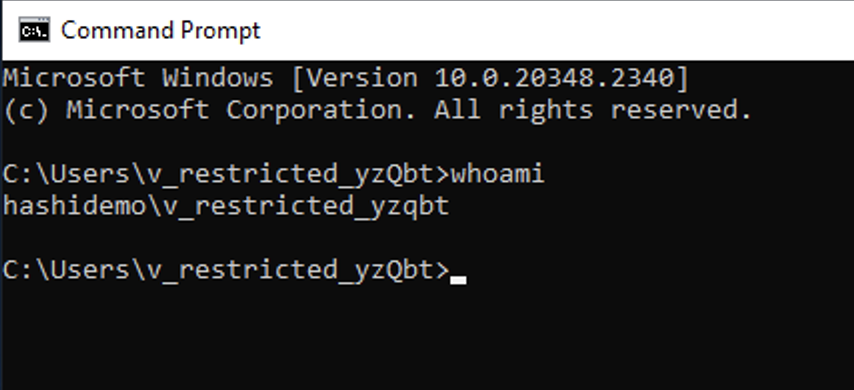
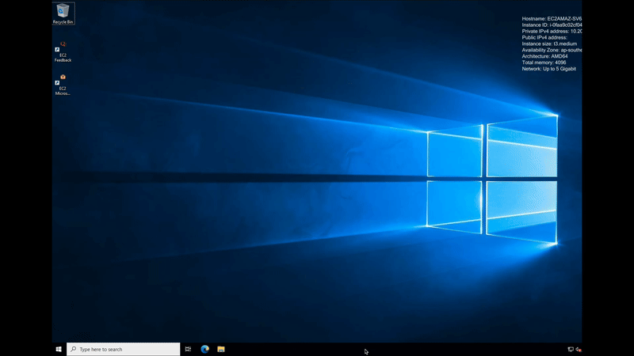
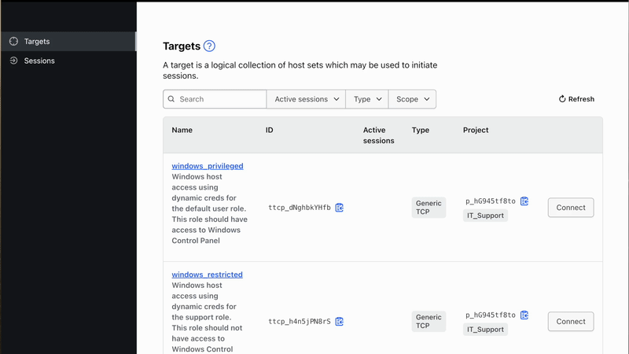
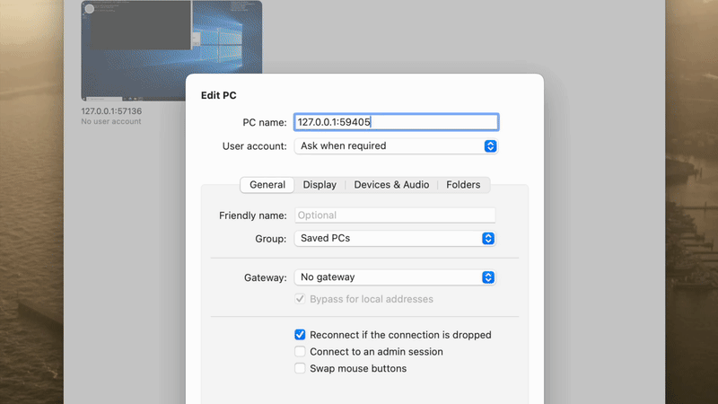
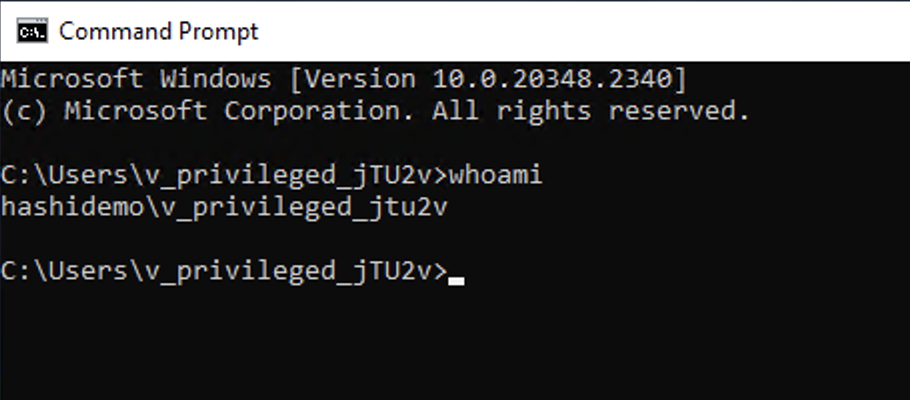

## Pre-Requisites
- HCP Account
- AWS Account
- [HCP service principal credentials](https://registry.terraform.io/providers/hashicorp/hcp/latest/docs/guides/auth)
- [Boundary](https://developer.hashicorp.com/boundary/install) and [Vault](https://developer.hashicorp.com/vault/docs/install) CLI
- [Boundary Desktop](https://developer.hashicorp.com/boundary/tutorials/hcp-getting-started/hcp-getting-started-desktop-app)
- Microsoft Remote Desktop

## Initial Setup
Once creds are created as per prerequisites, we need to make them available to Terraform as below.
```sh
export <AWS_CREDS>
export TF_VAR_hcp_client_id=<hcp_client_id>                 #The OAuth2 Client ID for API operations.
export TF_VAR_hcp_client_secret=<hcp_client_secret>         #The OAuth2 Client Secret for API operations.
export TF_VAR_hcp_boundary_admin=<hcp_boundary_username>    #The username of the initial admin user. This must be at least 3 characters in length, alphanumeric, hyphen, or period.
export TF_VAR_hcp_boundary_password=<hcp_boundary_password> #The password of the initial admin user. This must be at least 8 characters in length.
```
Below variables are optional and are configured with default values in `variables.tf` file. You may change the default values either by exporting using `TF_VAR_<varname>` or by setting their values in `.tfvars` file.
```sh
ad_domain=<windows-domain>                  #e.g. hashidemo.com
timezone=<windows_machine_timezone>         #e.g. "Singapore Standard Time"
aws_region=<aws_region>                     #e.g. "ap-southeast-1"
aws_vpc_cidr=<vpc_cidr>                     #e.g. "10.200.0.0/16"
aws_public_subnets=<public_subnet_cidr>     #e.g. ["10.200.10.0/24"]
aws_private_subnets=<private_subnet_cidr>   #e.g. ["10.200.20.0/24"]
boundary_version=<boundary_version>         #e.g. "0.15.2+ent", this should match HCP Boundary Cluster version
boundary_tier=<boundary_tier>               #e.g. "Plus" 
vault_tier=<vault_tier>                     #e.g. "dev", Refer https://registry.terraform.io/providers/hashicorp/hcp/latest/docs/resources/vault_cluster for valid values
```

## Clone this repo to your local machine
```sh
git clone <repo_url>
cd <cloned-directory>
```

## Setup HCP Boundary and HCP Vault cluster
```sh
terraform init -upgrade
terraform validate
terraform apply -target module.hcp
```
This step creates HCP Boundary and HCP Vault cluster. The terraform output should list below values. Please note HCP Boundary is configured with private endpoint of HCP Vault. The public HCP Vault URL and token is made available if you would like to explore HCP Vault features. 
```sh
boundary_cluster_url
vault_cluster_public_url
vault_cluster_admin_token
```

## Setup AWS Infrastructure, Boundary and Vault resources
```sh
terraform apply -target module.resources
```
This step should setup all required infrastructure resources including networking, security groups, EC2 instances, Boundary and Vault resources as per the below diagram.
The infrastructure is setup in AWS within a single region, featuring a single VPC and a single public and private subnet. The Windows domain controller and the target Windows machine are hosted in the private subnet.


## Test the workflow as "support" user

1.Login to Boundary Desktop Client as `support` user. The password for this user is available from the terraform output. The `support` user should have access to `windows_restricted` target only.

<p>

2.Click on the "Connect" button to retrieve time-bound, dynamic Active Directory (AD) credentials. Please note that the username part of the dynamic credentials starts with `v_restricted`, as per the Vault dynamic secret backend role configured for this target.

<p>

3.Connect to the remote target.<p>
Configure Microsoft Remote Desktop client to connect to `windows_restricted` target. All details including destination address, Windows domain name and user credentials are available from the Boundary Desktop.

<p>

Once logged in to the Windows machine, you can open the command prompt and run the `whoami` command to confirm that the logged-in user is indeed the dynamically generated user account.<p>
<p>

Let's also verify if the `support` user has access to the Control Panel. As expected, the dynamic AD credential presented to the `support` user does not allow access to the Windows Control Panel.<p>

<p>

## Test the workflow as "admin" user

1.Login to Boundary Desktop Client as `admin` user using the HCP Boundary admin credentials configured for creating the HCP Boundary cluster.  As expected, the admin user should have access to both the Boundary targets.

<p>

2.Click on the "Connect" button to retrieve the time-bound, dynamic AD credentials for accessing the `windows_privileged` target. Please note that the username part of the dynamic credentials starts with `v_privileged`, as per the Vault dynamic secret backend role configured for this target.

<p>

3.Connect to the remote target.<p>
Configure Microsoft Remote Desktop client to connect to `windows_privileged` target.

<p>

Once logged in to the Windows machine, run the `whoami` command to confirm that the logged-in user is using the dynamically generated privileged account credentials.<p>
<p>

Finally, let's verify that `admin` user has access to the Control Panel.

<p>
