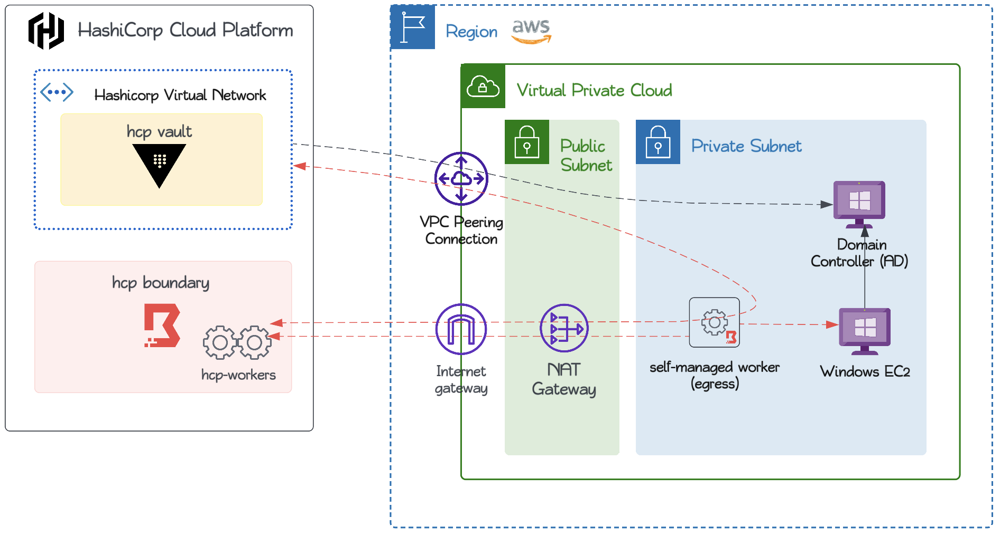
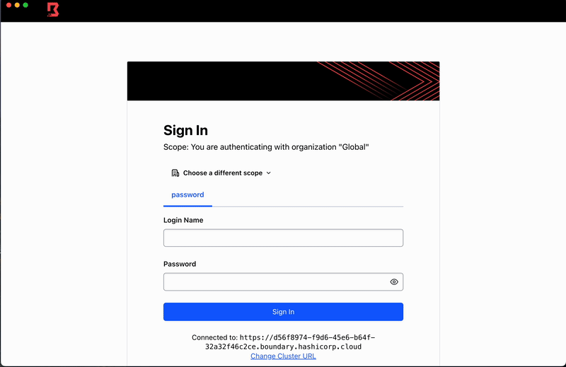
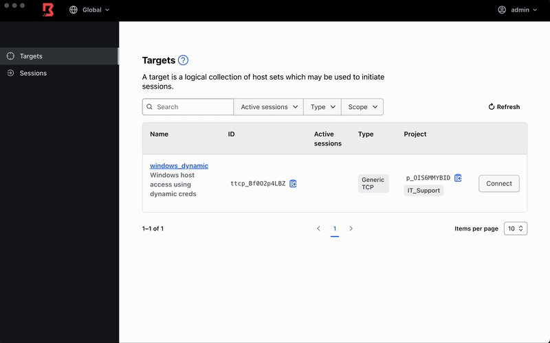
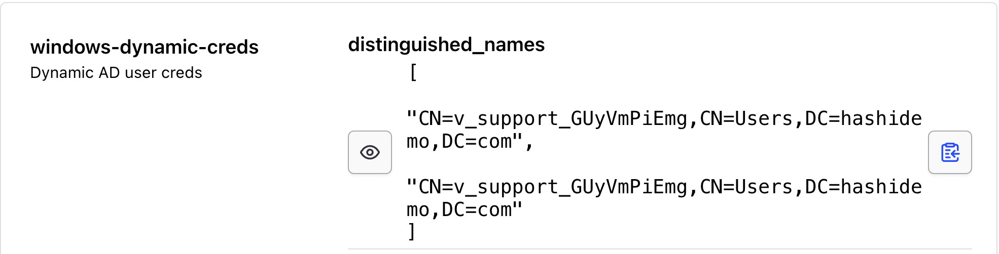
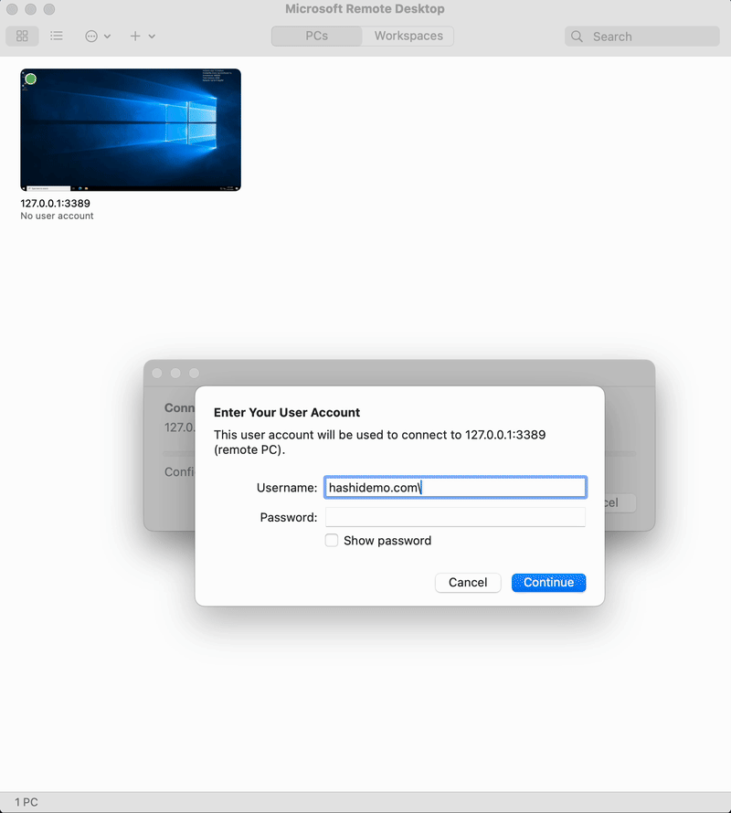
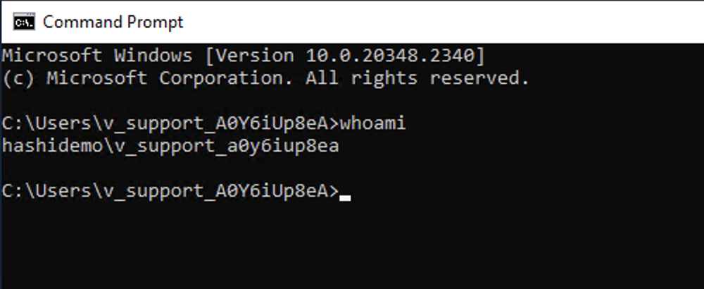

## Pre-Requisites
- HCP Account
- AWS Account
- [HCP service principal credentials](https://registry.terraform.io/providers/hashicorp/hcp/latest/docs/guides/auth)
- [Boundary](https://developer.hashicorp.com/boundary/install) and [Vault](https://developer.hashicorp.com/vault/docs/install) CLI
- [Boundary Desktop](https://developer.hashicorp.com/boundary/tutorials/hcp-getting-started/hcp-getting-started-desktop-app)
- Microsoft Remote Desktop

## Initial Setup
Once creds are created as per prerequisites, we need to make them available to Terraform as below.
```sh
export <AWS_CREDS>
export TF_VAR_hcp_client_id=<hcp_client_id>
export TF_VAR_hcp_client_secret=<hcp_client_secret>
export TF_VAR_hcp_boundary_admin=<hcp_boundary_username>    #The username of the initial admin user. This must be at least 3 characters in length, alphanumeric, hyphen, or period.
export TF_VAR_hcp_boundary_password=<hcp_boundary_password> #The password of the initial admin user. This must be at least 8 characters in length.
```
Below variables are optional and are configured with default values in `variables.tf` file. You may change the default values either by exporting using `TF_VAR_<varname>` or by setting their values in `.tfvars` file.
```sh
ad_domain=<windows-domain>                  #e.g. hashidemo.com
timezone=<windows_machine_timezone>         #e.g. "Singapore Standard Time"
aws_region=<aws_region>                     #e.g. "ap-southeast-1"
aws_vpc_cidr=<vpc_cidr>                     #e.g. "10.200.0.0/16"
aws_public_subnets=<public_subnet_cidr>     #e.g. ["10.200.10.0/24"]
aws_private_subnets=<private_subnet_cidr>   #e.g. ["10.200.20.0/24"]
boundary_version=<boundary_version>         #e.g. "0.15.2+ent", this should match HCP Boundary Cluster version
boundary_tier=<boundary_tier>               #e.g. "Plus" 
vault_tier=<vault_tier>                     #e.g. "dev", Refer https://registry.terraform.io/providers/hashicorp/hcp/latest/docs/resources/vault_cluster for valid values
```

## Clone this repo to your local machine
```sh
git clone <repo_url>
cd <cloned-directory>
```

## Setup HCP Boundary and HCP Vault cluster
```sh
terraform init -upgrade
terraform validate
terraform apply -target module.hcp
```
This step creates HCP Boundary and HCP Vault cluster. The terraform output should list below values. Please note HCP Boundary is configured with private endpoint of HCP Vault. The public HCP Vault URL and token is made available if you would like to explore HCP Vault features. 
```sh
boundary_cluster_url
vault_cluster_public_url
vault_cluster_admin_token
```

## Setup AWS Infrastructure and Boundary resources
```sh
terraform apply -target module.resources
```
This step should setup all required infrastructure resources including networking, security groups, EC2 instances, Boundary and Vault resources as per the below diagram.



## Test the workflow

1.Login to Boundary Desktop Client using the HCP Boundary cluster URL and the admin credentials that were set up for creating the HCP Boundary cluster. 

<p>

2.Click on the "Connect" button to retrieve time-bound, dynamic Active Directory (AD) credentials.

<p>

3.Connect to the remote target.<p>
We now have all the details as shown below to connect to the remote Windows host. Please note that the destination address is `127.0.0.1:3389`, as Boundary establishes a secure connection from the user's local machine to the Boundary worker. Additionally, the Windows domain name is set to default value of `hashidemo.com`. The domain name is also available as part of the distinguished_names field in dynamic credentials output as shown below.  

<p>

Let's configure Microsoft Remote Desktop client with the details provided from the Boundary Desktop output to connect to the remote target.<p>
<p>

Once logged in to the Windows machine, you can open the command prompt and run the `whoami` command to confirm that the logged-in user is indeed the dynamically generated user account.<p>
<p>

